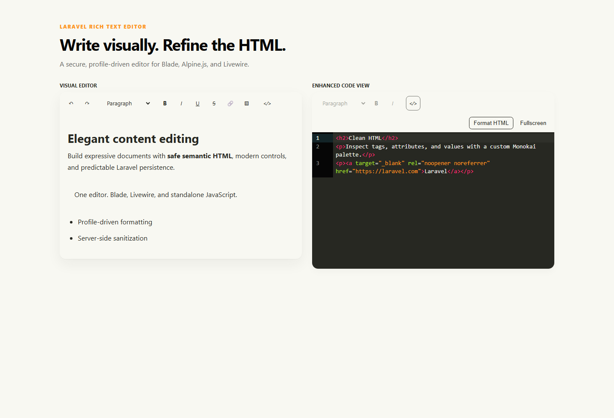

# Laravel Rich Text Editor

A modern, secure rich text editor for Laravel forms, Alpine.js, Tailwind CSS, and Livewire. It stores semantic HTML, ships with its browser assets, and provides both a lightweight code view and an enhanced Monokai code editor.



> This README is the express guide. See the [full documentation](docs/README.md) for every option, integration, and security detail.

## Requirements

- PHP 8.1 or newer
- Laravel 10, 11, 12, or 13
- Livewire 3 or 4 when Livewire binding is needed
- A modern evergreen browser

## Install

```bash
composer require arm092/laravel-rich-text-editor
php artisan rich-text-editor:publish
```

The publish command copies the configuration and prebuilt assets. Use `--force` after upgrades when you intentionally want to refresh published files.

## Blade in one minute

```blade
<x-rich-text-editor
    name="content"
    :value="old('content', $post->content)"
    label="Content"
    profile="standard"
/>
```

The submitted `content` value is HTML. For safe persistence, add the package cast:

```php
use Arm092\RichTextEditor\Casts\RichTextCast;

protected function casts(): array
{
    return [
        'content' => RichTextCast::class . ':standard',
    ];
}
```

Laravel 10 applications should place the same entry in the model's protected
`$casts` property.

Render saved content through the defensive renderer:

```blade
<x-rich-text-content :content="$post->content" profile="standard" />
```

## Livewire

```blade
<x-rich-text-editor wire:model="form.content" label="Content" />
```

The component synchronizes through a native textarea and isolates the editor-managed DOM with `wire:ignore`. Default, `.live`, `.blur`, and `.change` model modifiers pass through unchanged.

## Standalone JavaScript

Basic code view:

```html
<script src="/vendor/rich-text-editor/rich-text-editor.js" defer></script>
<div data-rich-text-editor></div>
```

Enhanced code view:

```html
<script src="/vendor/rich-text-editor/rich-text-editor-with-code.js" defer></script>
<div id="editor"></div>
<script>
    document.addEventListener('DOMContentLoaded', () => {
        window.editor = RichTextEditor.create('#editor')
    })
</script>
```

Both files expose the same API: `create`, `scan`, `destroy`, `getHTML`, `setHTML`, `focus`, `setReadOnly`, and instance `destroy`.

## Common configuration

| Option | Default | Purpose |
| --- | --- | --- |
| `default_profile` | `standard` | Selects the formatting and sanitizer profile. |
| `code_view.enabled` | `true` | Shows the HTML code-view command. |
| `code_view.enhanced` | `true` | Loads the enhanced or basic browser bundle. |
| `assets.auto` | `true` | Lets the Blade component include published assets once. |
| `profiles.*.headings` | `[2, 3, 4]` | Restricts heading levels. |
| `profiles.*.font_sizes` | `[]` | Enables only named, allowlisted text sizes. |

The default palette is configurable through CSS variables and `config/rich-text-editor.php`: Primary `#FD971F`, Success `#A6E22E`, Error `#F92672`, Info `#66D9EF`, Graphite `#272822`, Ink `#060606`, Paper `#F8F8F2`, and White `#FFFFFF`.

## Documentation

- [Installation and updates](docs/installation.md)
- [Blade and Livewire](docs/blade.md)
- [Standalone JavaScript](docs/standalone.md)
- [Configuration and profiles](docs/configuration.md)
- [Code view](docs/code-view.md)
- [Security, casting, and rendering](docs/security.md)
- [JavaScript API and events](docs/javascript-api.md)
- [Troubleshooting](docs/troubleshooting.md)
- [Roadmap](docs/roadmap.md)

## License

Laravel Rich Text Editor is open-source software released under the [MIT License](LICENSE.md).
